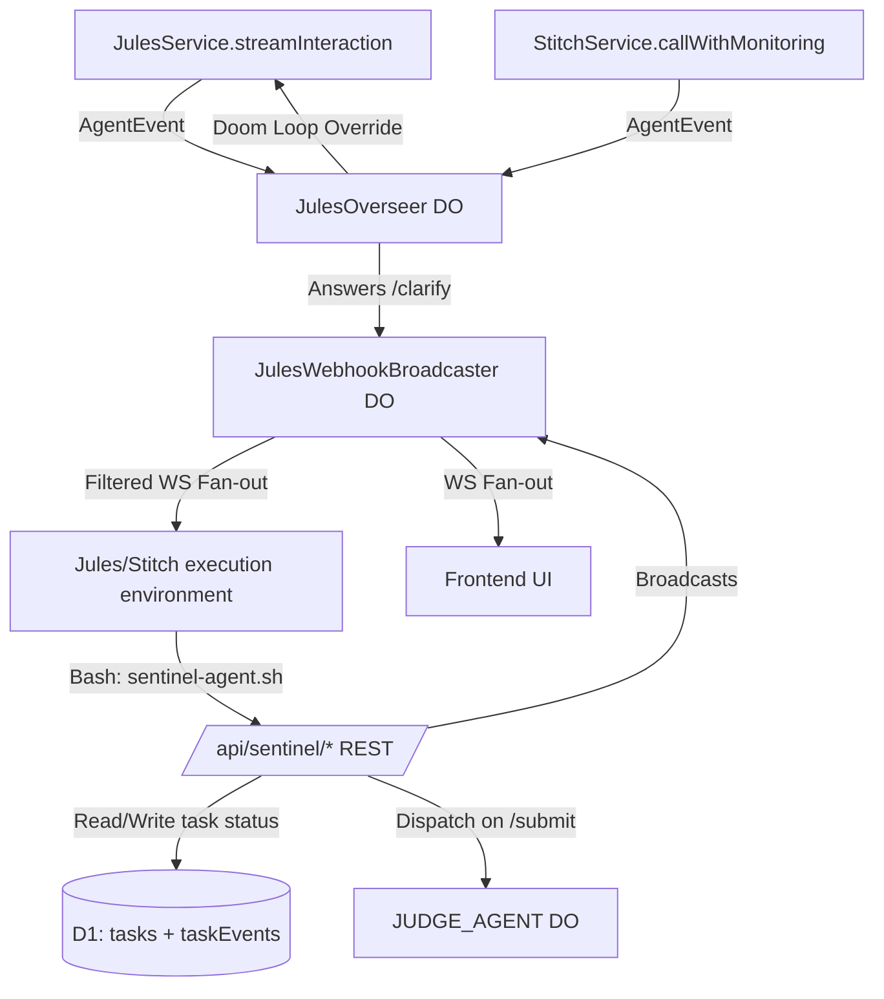

# Project Sentinel: Supervisory Infrastructure — Merged Implementation Plan (v3)

This plan unifies the real-time "Babysitter" stream monitoring approach with the Agent-Native Task Management REST API approach. 

## Core Philosophy (Antigravity-Aligned)
- **Zero new tables:** We reuse the existing `tasks`, `taskEvents`, and `workshopProjectTasks` tables.
- **Zero new Durable Objects:** We extend `JulesOverseer` for orchestration/monitoring and `JulesWebhookBroadcaster` for fan-out.
- **Unified Auth:** All interactions use either `AGENTIC_WORKER_API_KEY` (for agents) or `WORKER_API_KEY` (for internal services).

---

## User Review Required

> [!IMPORTANT]
> **Judge Agent Dispatch Added** — When an agent calls `POST /api/sentinel/tasks/:id/submit`, the API will mark the task as `in_review` and immediately dispatch the existing `JUDGE_AGENT` binding to peer-review the submitted PR or code path.

> [!IMPORTANT]
> **JulesWebhookBroadcaster Modification** — The existing broadcaster will be updated to enforce `apiKey` authentication parameters on the WS upgrade, and it will support `projectId` room filtering so agents only receive broadcasts for their active project.

---

## Architecture Diagram

---

## Proposed Changes

### Component 1: Sentinel Task API Routes (`/api/sentinel/*`)

**File:** `src/backend/src/routes/api/sentinel/index.ts` (NEW)

Create a new Hono router authenticated by `AGENTIC_WORKER_API_KEY` or `WORKER_API_KEY`.

| Method | Path | Action |
|--------|------|--------|
| `GET` | `/tasks/available` | List `tasks` where `assignee IS NULL` and `status='todo'` |
| `GET` | `/tasks/:id` | Get task details including epic/story context |
| `POST` | `/tasks/:id/claim` | Sets `assignee=agentId`, `status='in_progress'`, inserts `taskEvents`, broadcasts `task_claimed` |
| `PATCH` | `/tasks/:id` | Updates task fields, inserts `taskEvents`, broadcasts `task_updated` |
| `POST` | `/tasks/:id/submit` | Sets `status='in_review'`, broadcasts `task_submitted`, and **dispatches `JUDGE_AGENT`** (via `env.JUDGE_AGENT.get(env.JUDGE_AGENT.idFromName('task-reviewer'))`) |
| `POST` | `/tasks/:id/clarify` | Broadcasts `clarification_request` to `JulesWebhookBroadcaster` |
| `GET` | `/status` | Aggregates JulesOverseer status + D1 task counts |
| `GET` | `/health` | Returns health status |

### Component 2: Agent CLI (`scripts/sentinel-agent.sh`)

**File:** `scripts/sentinel-agent.sh` (NEW) *(Will also be copied to core-github-standardization)*

A bash script providing functions that wrap the `/api/sentinel/*` routes, to be sourced by agents in Sandbox environments:
- `sentinel_list_tasks`
- `sentinel_claim_task {id} jules`
- `sentinel_update_task {id} in_progress "Status update"`
- `sentinel_ask {id} "Question for orchestrator"`
- `sentinel_submit {id} "Summary" "https://pr-url"`

### Component 3: JulesWebhookBroadcaster Enhancements

**File:** `src/backend/src/do/JulesWebhookBroadcaster.ts` (MODIFY)

1. **Authentication:** In the `fetch` handler for `GET /ws`, enforce that `url.searchParams.get('apiKey')` matches `env.AGENTIC_WORKER_API_KEY` or `env.WORKER_API_KEY`.
2. **Subscription Filtering:**
   - Listen for WebSocket message: `{"type":"subscribe","projectId":"<id>"}`.
   - Store the subscribed `projectId` in a `WeakMap<WebSocket, { projectId: string }>`.
3. **Targeted Broadcasts:** In `POST /internal/broadcast`, inspect the payload for `projectId`. Only fan-out to websockets subscribed to that specific `projectId` (or `system:all`).

### Component 4: JulesOverseer Capabilities

**File:** `src/backend/src/ai/agents/JulesOverseer.ts` (MODIFY)

Append the following logic to the existing DO orchestration loop:

1. **`/ingest` Endpoint:** Handle incoming `AgentEvent` payloads from the Babysitter streaming layer (Jules) and Pre/Post hooks (Stitch).
2. **Doom-Loop Detection:** Check the last 10 messages for 3+ occurrences of apology patterns (`/i apologize/i`, `/let me try again/i`). If detected, inject a `[SYSTEM OVERRIDE]` message via `JulesService.sendMessage()`.
3. **Clarification Handling (Auto-Context):** Listen for `clarification_request` broadcasts (emitted by `/api/sentinel/tasks/:id/clarify`). Use `runAgentText()` to determine the answer from project context, then broadcast back a `clarification_response`.

### Component 5: Babysitter Callbacks in Agent Services

**File:** `src/backend/src/services/jules/service.ts` (MODIFY)
Add `streamInteraction(sessionId, monitoringAgentId)` which opens a native `session.stream()`, normalizes to `AgentEvent`, and pushes to JulesOverseer `/ingest`.

**File:** `src/backend/src/services/stitch/service.ts` (MODIFY)
Add `callWithMonitoring()` which emits `AgentEvent` start/complete hooks to JulesOverseer `/ingest` around `callTool()`.

---

## Technical Standards Checklist
- All new routes use `@hono/zod-openapi` following `src/backend/src/routes/api/frontend/planner/tasks.ts` patterns.
- `taskEvents` rows capture `eventType`, `fieldName`, `oldValue`, and `newValue` for every state transition.
- The `JUDGE_AGENT` dispatch correctly uses DO Stub fetching.
- `[SYSTEM OVERRIDE]` messages are properly prefixed so the agent LLMs recognize explicit orchestration commands.
- The `sentinel-agent.sh` script relies purely on standard binaries (`curl`) available inside the Sandbox.

---

## Verification Plan

### Automated Checks
- `pnpm run check` (TypeScript compilation)
- `pnpm run db:auto` (Should assert NO new migrations required for the tasks domain, as tables are preexisting)
- `pnpm run dry-run` (Validates wrangler bindings and bundle size)

### Live Functional Testing
1. **API Validation:** Test `/api/sentinel/tasks/available` via cURL with valid API key.
2. **CLI Flow:** Source `sentinel-agent.sh` locally and successfully run `sentinel_claim_task`, `sentinel_update_task`, and `sentinel_submit`. Verify `JUDGE_AGENT` logs show incoming review requests upon submit.
3. **WebSocket PubSub:** Launch two `wscat` sessions. Subscribe one to `proj-test`. Send a task update to `proj-test` via API. Verify only the subscribed client receives the broadcast.
4. **Doom Loop E2E:** Inject 4 apology phrases into a test Jules session sequentially. Verify `JulesOverseer` detects the loop and injects the `[SYSTEM OVERRIDE]` remediation message.
