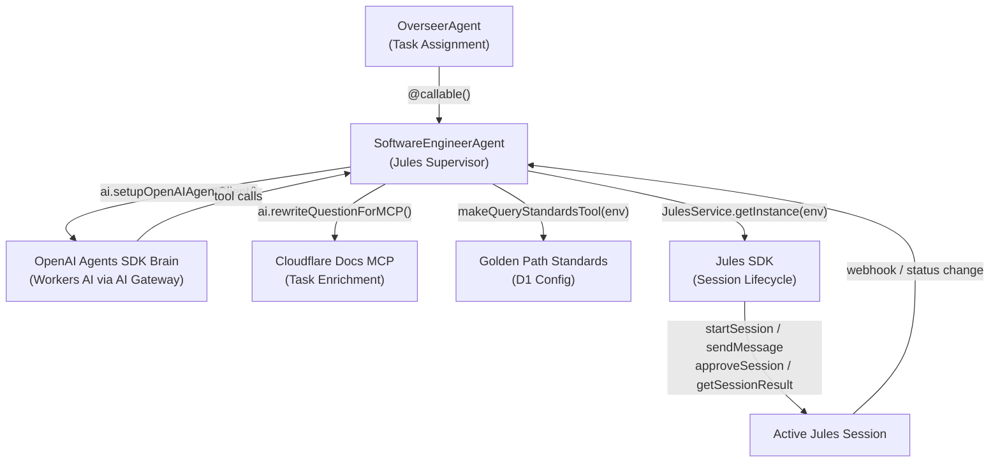

# Implementation Plan — Software Engineer Agent V2

User Feedback overall - a frontend is required for transparency and oversight:

```markdown
we need to have a websocket api for showing the progress of this

on the frontend there should be a status page whereby there is a visual diagram showing the overall hierarchy of orchestrator agent and agents the orchestator has assigned tasks to and what is happening under each agent

so we would see orchestrator -> swe and then we would see milestones under the swee for the brain evaluating the task, the brain enriching the task [with cloudflare docs mcp , golden path standardization, etc], the brain creating a single jules session or breaking the task out into a fleet of parallel tasks and then merging back

or a pattern like a triangle described with the orchestrator, software engineer, and stitch design agent

the various steps would be mapped out and realtime websocket api updates would show milestone progress and milestone status updtes like a milestone progress going from staged to in progress to pending review to {blocked, complete , etc}
```

Refactor `SoftwareEngineerAgent` from a basic Jules session launcher into a **Jules orchestration supervisor** that uses the project's existing service APIs as its foundation.

## Architecture



## Proposed Changes

### 1. Fix Broken Import

---

#### [MODIFY] [standards.ts](file:///Volumes/Projects/workers/core-github-api/src/backend/src/ai/mcp/tools/standards.ts)

The `@/ai/agents/honi` module does not exist. Replace with the `tool` helper from the `ai` package (Vercel AI SDK), which is already used identically across all other tool definitions in the project.

```diff
-import { tool } from "@/ai/agents/honi";
+import { tool } from "ai";
```

> [!NOTE]
> The `@/services/golden-path-config` import on line 2 is valid — confirmed the file exists at [golden-path-config.ts](file:///Volumes/Projects/workers/core-github-api/src/backend/src/services/golden-path-config.ts).

---

### 2. Refactor SoftwareEngineerAgent

---

#### [MODIFY] [SoftwareEngineerAgent.ts](file:///Volumes/Projects/workers/core-github-api/src/backend/src/ai/agents/implementers/SoftwareEngineerAgent.ts)

**Current state**: The agent creates Jules sessions and does basic docs injection via `getAgentByName()` RPC. No internal brain, no supervision loop, no standards enrichment.

**Target state**: The agent becomes a Jules orchestration supervisor with an internal OpenAI Agents SDK brain.

##### A. Brain Integration — `AIProvider.setupOpenAIAgentClient()`

Use the existing [setupOpenAIAgentClient](file:///Volumes/Projects/workers/core-github-api/src/backend/src/ai/providers/clients/openai/agent.ts#L18-L36) method from `AIProvider` to initialize the brain. This routes through Cloudflare AI Gateway in OpenAI-compatible mode, meaning we can use **Workers AI models** (e.g., `@cf/meta/llama-3.3-70b-instruct-fp8-fast`) as the backing model while using the `@openai/agents` SDK for tool orchestration.

```typescript
// In onStart or lazy init
await this.ai.setupOpenAIAgentClient("worker-ai");
```

Then use `AIProvider.runWithOpenAIAgent()` to execute the brain with tools:

```typescript
const result = await this.ai.runWithOpenAIAgent(
  taskPrompt,
  {
    name: "SoftwareEngineerBrain",
    instructions: goldenPathInstructions,
    tools: [queryStandardsTool, ...julesTools],
  },
  { provider: "worker-ai" },
);
```

##### B. Docs Enrichment — `AIProvider.rewriteQuestionForMCP()`

Replace the current `getAgentByName(CLOUDFLARE_DOCS_AGENT)` RPC with the existing [rewriteQuestionForMCP](file:///Volumes/Projects/workers/core-github-api/src/backend/src/ai/providers/methods/orchestration.ts#L24-L43) method.

```typescript
// Before: raw agent RPC
const docsAgent = await getAgentByName(
  this.env.CLOUDFLARE_DOCS_AGENT,
  "global",
);
const result = await docsAgent.chat(prompt);

// After: uses AIProvider's built-in method
const optimizedQuery = await this.ai.rewriteQuestionForMCP(prompt, {
  bindings: ["D1", "R2", "AI"],
  libraries: ["hono", "drizzle-orm"],
  tags: ["workers", "agents-sdk"],
});
```

Then query Cloudflare Docs MCP with the rewritten query and inject the result into the Jules session via `jules.sendMessage()`.

##### C. Golden Path Standards — `makeQueryStandardsTool(env)`

Use [makeQueryStandardsTool](file:///Volumes/Projects/workers/core-github-api/src/backend/src/ai/mcp/tools/standards.ts#L11-L58) to pull D1-stored golden path coding standards and inject them into the Jules session prompt. Also use [buildCodingAgentInstructions](file:///Volumes/Projects/workers/core-github-api/src/backend/src/services/golden-path-config.ts#L487-L504) to build the system prompt for the brain:

```typescript
import { buildCodingAgentInstructions } from "@/services/golden-path-config";
import { makeQueryStandardsTool } from "@/ai/mcp/tools/standards";

// Build brain instructions enriched with golden path
const instructions = await buildCodingAgentInstructions(this.env, {
  scopeTitles: ["backend", "ai", "infra"],
  infrastructures: ["coding-agent", "workers"],
});

// Make standards available as an OpenAI Agent tool
const standardsTool = makeQueryStandardsTool(this.env);
```

##### D. Jules Lifecycle — `JulesService`

The agent continues using [JulesService](file:///Volumes/Projects/workers/core-github-api/src/backend/src/services/jules/service.ts) (singleton) for all Jules SDK interactions. No direct SDK imports. New supervision methods:

| Method                    | Purpose                                                                      | JulesService API                                     |
| ------------------------- | ---------------------------------------------------------------------------- | ---------------------------------------------------- |
| `enrichAndStartSession()` | Gather standards + docs → build enriched prompt → `jules.startSession()`     | `startSession()`                                     |
| `handlePlanReady()`       | Brain reviews plan → `jules.approveSession()` or `jules.reviseSessionPlan()` | `approveSession()`, `reviseSessionPlan()`            |
| `handleQuestion()`        | Brain answers Jules question → `jules.sendMessage()`                         | `sendMessage()`                                      |
| `handleSessionComplete()` | Brain reviews code → approve PR or request changes                           | `getSessionResult()`, `getCodeReviewContext()`       |
| `runFleet()`              | Parallel sessions → `jules.startParallelSessions()` → reconcile              | `startParallelSessions()`, `collectSessionOutcome()` |

##### E. Status Subscription

Jules status changes are received via **webhook callbacks** (already wired into the system via `buildWebhookInstruction()`). The webhook handler routes status events back to the `SoftwareEngineerAgent` via `@callable()` methods:

```typescript
@callable()
async onJulesStatusChange(sessionId: string, status: string, payload: any) {
  switch (status) {
    case 'plan_ready':
      return this.handlePlanReady(sessionId, payload);
    case 'waiting_for_user':
      return this.handleQuestion(sessionId, payload);
    case 'completed':
      return this.handleSessionComplete(sessionId, payload);
    case 'failed':
      return this.handleSessionFailed(sessionId, payload);
  }
}
```

---

## Stitch Integration & The Collaboration Triangle

Feedback from user:

```markdown
There should be dedicated well lit paths where a software agnet has been tasked with building a feature full stack that requires a frontend and backend be built and hooking up the frontend with the backend -- or -- the backend already exists and a frontend needs to be created via reverse engineering what the backend alraedy offers

That means the planning component of the sfotware agent certainely needs to involve a plan for the frontend if its determined that a frontend is invovled int he task at hand which is most certainely the majority of times.

And on any task the software agent is working on it should be considering the frontend implications -- like lets say the frontend already exists on an app and th software agent has been asked to modify how the backend is processing a form submission for example .. given the form is hosted on the frontend where it is submitted to the backend, the software agent should be considering whether there will need to be any changes made to the frontend as a result of the improvement to the backend.

I think this is an example where we could have a ChatRoom session and shared task that the main orchestrator is overseeing, too so that there is almost a triangle of collaboration

at the top of the triangle is the main orchestrator, the right lower point of the triagnle is the software agent, and the left lower point of the triangle is the StitchDesignAgent (src/backend/src/ai/agents/StitchDesignAgent.ts)
```

Based on the requirement for well-lit paths for full-stack feature development, the `SoftwareEngineerAgent` will adopt a "Triangle of Collaboration" pattern inside shared `ChatRoom` sessions.

**The Collaboration Triangle**:

1. **Top**: `OrchestratorAgent` (Oversees execution, cross-agent dependencies, and final verification).
2. **Lower Right**: `SoftwareEngineerAgent` (Jules Orchestrator — handles backend, database, API routing, and system architecture).
3. **Lower Left**: `StitchDesignAgent` (Stitch Orchestrator — handles UI/UX, components, and frontend API consumption).

**Behavioral Requirements**:

- The `SoftwareEngineerAgent` MUST ALWAYS consider frontend implications when executing a task (e.g., if changing a form submission handler at the backend, it must notify the `StitchDesignAgent` of the new expected schema).
- Neither sub-agent executes in a vacuum; they both report their plans to the `OrchestratorAgent`, which aligns their efforts before green-lighting execution (e.g., ensuring the Jules backend PR and the Stitch frontend PR are compatible).

---

## Fleet Merge Architectures (For Review)

Feedback from user:

```markdown
Please provide 2 design architectures for me to review -- a workflow architecture that is a cloudflare agents sdk running the workflow (ask cloudflare docs mcp) vs. the main orchestrator using mcp tools to both split the tasks up into parallel sessions and then to have the orchestrator handle the merge process vs. having the orchestrator assign the task to the software engineering agent and then the swe agent decides to split the tasks in parallel fleet where the swe agent then orchestrates each of those parallel sessions (enriching the session prompts, responding to jules, guardrailing, etc) and then the software agent handles the fleet merge process as well so that the main orchestrator just sees that the main assigned task was completed or assigned to a single PR but the main orchestrator is unaware that the asssigned task was dividied into fleet / merge chunks.ef
```

For multi-PR reconciliation and parallel task breakdown, please review the following two architectural proposals:

### Architecture A: Orchestrator-Driven Workflows

The Main Orchestrator is the active coordinator of parallel tasks and convergence.

- **Flow**: The `OrchestratorAgent` determines a task can be parallelized. It invokes a Cloudflare `WorkflowEntrypoint` (e.g., `JulesParallelWorkflow`). This workflow triggers parallel Jules sessions via the Jules MCP. When all parallel sessions complete, the `OrchestratorAgent` uses the Jules reconciliation MCP tools to merge the resulting PRs into a single master PR.
- **Pros**: The orchestrator maintains absolute visibility over every concurrent operation. Workflows natively handle long-running polling without consuming heavy DO memory.
- **Cons**: The orchestrator's state complexity increases significantly. It must understand the low-level GitHub/Jules reconciliation process.

### Architecture B: SWE Encapsulated Fleet (Recommended)

The Main Orchestrator assigns a monolithic task to the `SoftwareEngineerAgent`, unaware of how the sausage is made.

- **Flow**: The `SoftwareEngineerAgent` receives the task. Using its internal brain, it decides to split the task into multiple parallel chunks. It launches the parallel Jules sessions (the "fleet") itself. It acts as the direct supervisor for _each_ parallel session—enriching prompts, providing Cloudflare Docs, and unblocking Jules when it asks questions. Once the fleet is done, the `SoftwareEngineerAgent` executes the fleet merge process, creating the final reconciliation PR. It then reports a single "Task complete, PR created" message back to the Orchestrator.
- **Pros**: Clean separation of concerns. The Main Orchestrator stays lightweight and focused on business goals (e.g., "build this feature") rather than parallel execution pipelines.
- **Cons**: The `SoftwareEngineerAgent` DO must coordinate multiple active webhooks/callbacks concurrently, requiring robust state management to survive potential DO eviction.

> [!IMPORTANT]
> **User Review Required**: Please confirm if we should proceed with **Architecture A** or **Architecture B** for the Fleet Merge routing.

User Feedback:

```markdown
Architecture B ... lets use both the agent's durable object stateful memory (sqllite db) aand mirror that state to d1 table as well so that we can maintain transparency and visibility into whats happening and that if there is a DO eviction we can always reload state management from d1 tables ..... ask cloudflare docs mcp about stateful sqllite and the methods that go alongside it

also please fully investigate the d1 tables we currently have in place where I think you will likely find an existing table where we could mirror state

- src/backend/src/db/schemas/jules
- src/backend/src/db/schemas/agents [src/backend/src/db/schemas/agents/stateful.ts is drizzle managed stateful tables]

And if you cannot find existing tables under src/backend/src/db/schemas that are applicable, than please create the new tables needed in the correct folder under schemas/ where each table is its own module ts file.
```

## Verification Plan

### Automated Tests

- `pnpm run check` — verify all TypeScript errors are resolved (especially `standards.ts` honi import)
- `pnpm run dry-run` — verify Wrangler can bundle the worker

### Manual Verification

- Trigger `createPlan` via PlanningRoom and verify:
  1. Golden Path standards are injected into the Jules prompt
  2. Cloudflare Docs enrichment is applied
  3. The brain's system prompt contains `buildCodingAgentInstructions` output
