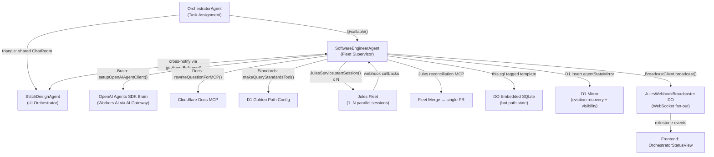

# Implementation Plan — Software Engineer Agent V2 (Revised)

> **Revision note**: This replaces `plan.md` with the following corrections:
> - Architecture B (SWE Encapsulated Fleet) is confirmed.
> - Dual storage strategy specified: native Agents SDK `this.sql` (DO embedded SQLite) as the hot path + D1 mirror for visibility and eviction recovery.
> - Existing D1 tables identified for reuse — no new tables required unless noted.
> - WebSocket milestone broadcast API fully specified.
> - Frontend status page with visual hierarchy diagram added.
> - Triangle Collaboration pattern elaborated with concrete implementation steps.
> - All Cloudflare Agents SDK patterns verified against current docs (v0.6.x).

---

## Context

The `SoftwareEngineerAgent` currently creates Jules sessions and does basic docs injection. The user requires it to become a full orchestration supervisor with:

1. An internal LLM brain for enrichment, planning, and supervision.
2. Fleet parallelism (multiple Jules sessions per task) managed entirely within the SWE agent — invisible to the Orchestrator above.
3. A "Triangle of Collaboration" so fullstack tasks coordinate between SWE and `StitchDesignAgent` under the Orchestrator's supervision.
4. Eviction-resilient state via dual storage: DO-local `this.sql` (fast path) + D1 `agentStateMirror` (transparency + recovery).
5. A real-time WebSocket API surfacing milestone progress to a new frontend status page.

---

## Architecture Diagram



---

## Step 1 — Fix Broken Import (Carryover from V1)

**File**: `src/backend/src/ai/mcp/tools/standards.ts`

```diff
-import { tool } from "@/ai/agents/honi";
+import { tool } from "ai";
```

This is a prerequisite for TypeScript to compile. The `tool` helper from the `ai` package (Vercel AI SDK) is identical to the one used across all other tool definitions in the project.

---

## Step 2 — Native DO SQLite Tables via `this.sql`

The Agents SDK exposes `this.sql` as a first-class tagged template literal on every `Agent` class instance. This is the recommended hot-path for per-agent state — faster than external D1 and survives within the DO's lifetime.

**Add to `SoftwareEngineerAgent.onStart()`** — idempotent DDL via `this.sql`:

```typescript
async onStart() {
  this.ai = new AIProvider(this.env);
  this.logger = new Logger(this.env, 'SoftwareEngineerAgent');

  // Initialize embedded SQLite schema (idempotent — safe to call on every start)
  this.sql`
    CREATE TABLE IF NOT EXISTS swe_fleet_sessions (
      id          TEXT PRIMARY KEY,          -- Jules session ID
      request_id  TEXT NOT NULL,             -- planningRequestId
      role        TEXT NOT NULL,             -- 'solo' | 'fleet-member' | 'stitch'
      status      TEXT NOT NULL DEFAULT 'active',
      prompt_hash TEXT,                      -- SHA of enriched prompt (dedup guard)
      created_at  TEXT DEFAULT CURRENT_TIMESTAMP,
      updated_at  TEXT DEFAULT CURRENT_TIMESTAMP,
      CONSTRAINT status_chk CHECK(status IN ('active','completed','failed','stuck','waiting_for_user'))
    );
    CREATE INDEX IF NOT EXISTS idx_swe_fleet_req ON swe_fleet_sessions (request_id);

    CREATE TABLE IF NOT EXISTS swe_milestones (
      id          TEXT PRIMARY KEY,
      request_id  TEXT NOT NULL,
      session_id  TEXT,                      -- Jules session ID (null for planning milestones)
      name        TEXT NOT NULL,             -- Human-readable name
      status      TEXT NOT NULL DEFAULT 'staged',
      detail      TEXT,
      updated_at  TEXT DEFAULT CURRENT_TIMESTAMP,
      CONSTRAINT status_chk CHECK(status IN ('staged','in_progress','pending_review','blocked','complete','failed'))
    );
    CREATE INDEX IF NOT EXISTS idx_swe_milestone_req ON swe_milestones (request_id);
  `;
}
```

### `this.sql` API reference (Agents SDK v0.6.x)

| Operation | Syntax |
|-----------|--------|
| DDL | `` this.sql`CREATE TABLE IF NOT EXISTS ...` `` |
| Insert | `` this.sql`INSERT INTO t VALUES (${val1}, ${val2})` `` |
| Query (typed) | `` const rows = this.sql<MyType>`SELECT * FROM t WHERE id = ${id}` `` |
| Returns | Cursor with `.toArray()`, `.one()`, `.raw()` methods |

> **Important**: `this.sql` is the Agents SDK tagged template API — distinct from `this.ctx.storage.sql.exec()` used in `stateful.ts`. Both work; `this.sql` is preferred for Agent subclasses.

---

## Step 3 — D1 Mirror Strategy (Eviction Recovery)

Use **existing D1 tables only** — no new schema files required.

| What to mirror | D1 Table | When to write |
|---|---|---|
| Full agent status snapshot | `agent_state_mirror` (`agentStateMirror` via `mirror.ts`) | Every `updateStatus()` call |
| Individual fleet sessions | `jules_sessions` (`julesSessions` via `sessions.ts`) | Already written by `JulesService.startSession()` — add `sessionRole: 'fleet-member'` |
| Milestone state | `planning_room_logs` (`planningRoomLogs`) | On each milestone transition, log to `planningRoomLogs` with `messageType: 'milestone'` |

**Recovery on DO eviction**: On `onStart()`, after DDL, restore `swe_fleet_sessions` from D1:

```typescript
// Reload fleet state from D1 if DO was evicted (swe_fleet_sessions is empty)
const existing = this.sql<{ id: string }>`SELECT id FROM swe_fleet_sessions LIMIT 1`;
if (existing.toArray().length === 0) {
  const db = getDb(this.env.DB);
  const sessions = await db
    .select()
    .from(julesSessions)
    .where(and(
      eq(julesSessions.agentId, this.name),
      eq(julesSessions.status, 'active')
    ));
  for (const s of sessions) {
    this.sql`INSERT OR IGNORE INTO swe_fleet_sessions (id, request_id, role, status)
             VALUES (${s.id}, ${s.planningRequestId ?? ''}, ${s.sessionRole ?? 'fleet-member'}, ${s.status})`;
  }
}
```

---

## Step 4 — Brain Integration

Extend `onStart()` to lazy-init the OpenAI Agents SDK brain via `AIProvider`:

```typescript
await this.ai.setupOpenAIAgentClient("worker-ai");
```

Build enriched brain instructions on each task:

```typescript
import { buildCodingAgentInstructions } from "@/services/golden-path-config";
import { makeQueryStandardsTool } from "@/ai/mcp/tools/standards";

const instructions = await buildCodingAgentInstructions(this.env, {
  scopeTitles: ["backend", "ai", "infra"],
  infrastructures: ["coding-agent", "workers"],
});
const standardsTool = makeQueryStandardsTool(this.env);
```

Replace `getAgentByName(CLOUDFLARE_DOCS_AGENT)` RPC with `AIProvider.rewriteQuestionForMCP()`:

```typescript
// Before
const docsAgent = await getAgentByName(this.env.CLOUDFLARE_DOCS_AGENT, "global");
const result = await docsAgent.chat(prompt);

// After
const optimizedQuery = await this.ai.rewriteQuestionForMCP(prompt, {
  bindings: ["D1", "R2", "AI"],
  libraries: ["hono", "drizzle-orm"],
  tags: ["workers", "agents-sdk"],
});
// Then call Cloudflare Docs MCP with optimizedQuery and inject into Jules prompt
```

---

## Step 5 — Milestone Management & WebSocket Broadcast

Add a private `emitMilestone()` helper that writes to DO SQLite, mirrors to D1 planningRoomLogs, and broadcasts via `JulesWebhookBroadcaster`:

```typescript
private async emitMilestone(
  requestId: string,
  name: string,
  status: MilestoneStatus,
  detail?: string,
  sessionId?: string,
) {
  const id = crypto.randomUUID();

  // 1. Write to DO SQLite (hot path — survives within DO lifetime)
  this.sql`
    INSERT INTO swe_milestones (id, request_id, session_id, name, status, detail)
    VALUES (${id}, ${requestId}, ${sessionId ?? null}, ${name}, ${status}, ${detail ?? null})
    ON CONFLICT(id) DO UPDATE SET status=${status}, detail=${detail ?? null}, updated_at=CURRENT_TIMESTAMP
  `;

  // 2. Mirror to D1 planningRoomLogs (transparency + cross-DO visibility)
  const db = getDb(this.env.DB);
  this.ctx.waitUntil(
    db.insert(planningRoomLogs).values({
      id,
      roomId: requestId,
      messageType: 'milestone',
      content: name,
      metadataJson: JSON.stringify({ status, sessionId, detail }),
    })
  );

  // 3. Broadcast to all connected WebSocket clients
  const payload: MilestoneEvent = {
    type: 'milestone_update',
    requestId,
    milestone: { id, name, status, sessionId, detail, timestamp: Date.now() },
  };
  this.ctx.waitUntil(
    BroadcastClient.broadcast(
      this.env.JULES_WEBHOOK_BROADCASTER,
      'jules-broadcaster',
      { projectId: requestId, ...payload },
    )
  );
}
```

**Milestone lifecycle for a standard task** (emitted in order):

| Milestone | Status flow |
|-----------|-------------|
| `brain:evaluate` | staged → in_progress → complete |
| `brain:enrich-docs` | staged → in_progress → complete |
| `brain:enrich-standards` | staged → in_progress → complete |
| `brain:plan-split` | staged → in_progress → complete (solo \| fleet-N) |
| `jules:session-{n}` | staged → in_progress → pending_review → complete \| blocked |
| `fleet:merge` | staged → in_progress → complete (fleet tasks only) |
| `stitch:frontend` | staged → in_progress → pending_review → complete (when frontend involved) |

---

## Step 6 — Jules Lifecycle Methods

Refactor `SoftwareEngineerAgent` to use these supervision methods (replacing the current bare `createPlan` / `executeImplementation`):

| Method | Replaces | Purpose |
|---|---|---|
| `enrichAndStartSession(requestId)` | `createPlan()` | Brain evaluates → enriches with docs + standards → calls `JulesService.startSession()` |
| `handlePlanReady(sessionId, payload)` | — | Brain reviews Jules plan → `approveSession()` or `reviseSessionPlan()` |
| `handleQuestion(sessionId, payload)` | — | Brain answers Jules question → `sendMessage()` |
| `handleSessionComplete(sessionId, payload)` | — | Brain reviews code → approve PR or request changes |
| `runFleet(requestId, subtasks[])` | `executeImplementation()` | Launch N parallel Jules sessions → supervise each → merge |
| `onJulesStatusChange(sessionId, status, payload)` | webhook only | Route Jules webhook callbacks to correct handler |

**Webhook routing** (`@callable()`):

```typescript
@callable()
async onJulesStatusChange(sessionId: string, status: string, payload: any) {
  // Update DO SQLite immediately
  this.sql`
    UPDATE swe_fleet_sessions SET status=${status}, updated_at=CURRENT_TIMESTAMP
    WHERE id=${sessionId}
  `;

  switch (status) {
    case 'plan_ready':         return this.handlePlanReady(sessionId, payload);
    case 'waiting_for_user':   return this.handleQuestion(sessionId, payload);
    case 'completed':          return this.handleSessionComplete(sessionId, payload);
    case 'failed':             return this.handleSessionFailed(sessionId, payload);
  }
}
```

---

## Step 7 — Fleet Encapsulation (Architecture B)

The Orchestrator assigns one task and receives one outcome. The SWE agent decides internally whether to run solo or fleet.

```typescript
@callable()
async executeTask(requestId: string) {
  await this.emitMilestone(requestId, 'brain:evaluate', 'in_progress');
  const plan = await this.brainEvaluateTask(requestId);
  await this.emitMilestone(requestId, 'brain:evaluate', 'complete');

  if (plan.requiresFleet) {
    return this.runFleet(requestId, plan.subtasks);
  } else {
    return this.enrichAndStartSession(requestId);
  }
}

private async runFleet(requestId: string, subtasks: SubTask[]) {
  await this.emitMilestone(requestId, 'brain:plan-split', 'complete', `Fleet of ${subtasks.length}`);

  const jules = JulesService.getInstance(this.env);
  const sessions = await jules.startParallelSessions(subtasks.map(t => ({
    ...t.params,
    planningRequestId: requestId,
    sessionRole: 'fleet-member',
    agentId: this.name,
  })));

  // Register all fleet members in DO SQLite
  for (const s of sessions) {
    this.sql`INSERT INTO swe_fleet_sessions (id, request_id, role, status)
             VALUES (${s.id}, ${requestId}, 'fleet-member', 'active')`;
  }

  // Mirror to D1 julesSessions (already handled by JulesService, sessionRole set above)

  // All fleet supervision happens via onJulesStatusChange() webhook callbacks.
  // When all fleet members reach 'completed', trigger fleet merge.
}

private async checkAndMergeFleet(requestId: string) {
  const pending = this.sql<{ id: string }>`
    SELECT id FROM swe_fleet_sessions
    WHERE request_id=${requestId} AND role='fleet-member' AND status != 'completed'
  `;
  if (pending.toArray().length > 0) return; // Still outstanding

  await this.emitMilestone(requestId, 'fleet:merge', 'in_progress');
  // Use Jules reconciliation MCP tools to merge fleet PRs into master PR
  const mergeResult = await this.orchestrateMerge(requestId);
  await this.emitMilestone(requestId, 'fleet:merge', 'complete', mergeResult.prUrl);

  // Report completion to Orchestrator — single task, single PR
  const orchestrator = await getAgentByName(this.env.ORCHESTRATOR_AGENT as any, 'global');
  await (orchestrator as any).onTaskComplete(requestId, mergeResult);
}
```

---

## Step 8 — Triangle of Collaboration

**When**: The SWE brain determines that a task has frontend implications (full-stack feature, backend change affecting form submission shapes, API contract changes, etc.).

**Flow**:

```
OrchestratorAgent assigns task
  → SWE brain evaluates → detects frontend involvement
  → SWE notifies StitchDesignAgent via getAgentByName() RPC
  → Both agents work concurrently in shared ChatRoom (roomId = requestId)
  → SWE reports API contract changes → Stitch adapts UI accordingly
  → Orchestrator sees both PRs (backend + frontend) before final approval
```

**Implementation in `enrichAndStartSession()`**:

```typescript
if (plan.involvesFrontend) {
  await this.emitMilestone(requestId, 'stitch:frontend', 'staged');

  // Notify StitchDesignAgent with the frontend scope derived from plan
  const stitchAgent = await getAgentByName(this.env.STITCH_DESIGN_AGENT as any, requestId);
  await (stitchAgent as any).onFrontendTaskAssigned({
    requestId,
    backendContext: plan.frontendImplications,
    sessionRole: 'stitch',
    repoContext: request.githubRepo,
  });
}
```

**SWE rule**: Before `handleSessionComplete()` approves any Jules PR, it checks whether the task had frontend implications. If yes, it waits for `StitchDesignAgent` to signal completion before reporting back to the Orchestrator.

---

## Step 9 — WebSocket API (Backend Route)

Add a route that proxies WebSocket upgrades to `JulesWebhookBroadcaster` scoped by `requestId`:

**File**: `src/backend/src/routes/api/projects/sentinel/ws.ts` (extend existing) or new route `src/backend/src/routes/api/orchestration/ws.ts`

```typescript
// GET /api/orchestration/ws?requestId=<id>
orchestrationWsRoute.get('/ws', async (c) => {
  const requestId = c.req.query('requestId');
  if (!requestId) return c.json({ error: 'requestId required' }, 400);
  return BroadcastClient.upgradeWebSocket(
    c.env.JULES_WEBHOOK_BROADCASTER,
    'jules-broadcaster',
    c.req.raw,
  );
});
```

**WebSocket message shape** emitted to clients:

```typescript
type MilestoneEvent = {
  type: 'milestone_update';
  requestId: string;
  milestone: {
    id: string;
    name: string;           // 'brain:evaluate' | 'jules:session-1' | 'stitch:frontend' | etc.
    status: MilestoneStatus;
    sessionId?: string;
    detail?: string;
    timestamp: number;
  };
};

type MilestoneStatus =
  | 'staged'
  | 'in_progress'
  | 'pending_review'
  | 'blocked'
  | 'complete'
  | 'failed';
```

---

## Step 10 — Frontend Status Page

**File**: `src/frontend/src/views/repos/EmbeddedPlanningRoom.tsx` — extend existing or create sibling `OrchestratorStatusView.tsx`.

### Visual Hierarchy

The page renders a live graph:

```
                     ┌─────────────────┐
                     │  OrchestratorAgent  │
                     └────────┬────────┘
                              │
               ┌──────────────┼──────────────┐
               ▼                             ▼
   ┌─────────────────────┐       ┌─────────────────────┐
   │  SoftwareEngineerAgent  │       │  StitchDesignAgent  │
   └──────────┬──────────┘       └──────────┬──────────┘
              │                             │
    ┌─────────┴────────┐           ┌────────┴────────┐
    │  Milestones       │           │  Stitch screens  │
    │  brain:evaluate ●  │           │  frontend PR ●   │
    │  brain:enrich ●   │           └─────────────────┘
    │  jules:session-1 ●│
    │  fleet:merge ●    │
    └───────────────────┘
```

Each milestone node renders with a colored status indicator:
- `staged` → grey dot
- `in_progress` → pulsing blue
- `pending_review` → amber
- `blocked` → red
- `complete` → green
- `failed` → red X

### WebSocket connection hook

```typescript
// src/frontend/src/hooks/useOrchestratorStatus.ts
export function useOrchestratorStatus(requestId: string) {
  const [milestones, setMilestones] = useState<Milestone[]>([]);

  useEffect(() => {
    const ws = new WebSocket(`/api/orchestration/ws?requestId=${requestId}`);
    ws.onmessage = (e) => {
      const msg = JSON.parse(e.data) as MilestoneEvent;
      if (msg.type === 'milestone_update') {
        setMilestones(prev => upsertMilestone(prev, msg.milestone));
      }
    };
    return () => ws.close();
  }, [requestId]);

  return { milestones };
}
```

### Page anatomy

- **Header**: Planning request title + overall status badge
- **Graph section**: SVG or CSS-grid hierarchy diagram (Orchestrator at top, SWE + Stitch below, milestones as leaf nodes)
- **Event log panel**: Chronological list of milestone transitions (sourced from same WS stream)
- **Fleet expansion**: If fleet mode, each `jules:session-N` expands to show the Jules session prompt snippet + current step

**Route**: `/repos/[owner]/[repo]/projects/[requestId]/orchestration` — add to `RepoRoutes.tsx`.

---

## Step 11 — Health Check Registration

Add orchestration health check to `src/backend/src/health/coordinator.ts`:

```typescript
{ id: 'swe-agent', category: 'orchestration', fn: checkSWEAgentHealth }
```

Implement in `src/backend/src/ai/agents/orchestration/health.ts` (extend existing file):

```typescript
export async function checkSWEAgentHealth(env: Env): Promise<HealthStepResult> {
  const agent = await getAgentByName(env.SOFTWARE_ENGINEER_AGENT as any, 'global');
  const result = await (agent as any).ping();
  return {
    name: 'software-engineer-agent',
    status: result.status === 'pong' ? 'healthy' : 'unhealthy',
    message: result.status,
    durationMs: Date.now() - result.timestamp,
  };
}
```

---

## Critical Files

| File | Change |
|------|--------|
| `src/backend/src/ai/mcp/tools/standards.ts` | Fix import: `from "ai"` |
| `src/backend/src/ai/agents/implementers/SoftwareEngineerAgent.ts` | Full refactor — brain, fleet, milestones, triangle |
| `src/backend/src/ai/agents/orchestration/health.ts` | Add `checkSWEAgentHealth()` |
| `src/backend/src/health/coordinator.ts` | Register new health check |
| `src/backend/src/routes/api/orchestration/ws.ts` | New — WebSocket milestone proxy route |
| `src/backend/src/routes/api/index.ts` | Mount new orchestration WS route |
| `src/frontend/src/hooks/useOrchestratorStatus.ts` | New — WS hook |
| `src/frontend/src/views/repos/OrchestratorStatusView.tsx` | New — status page with hierarchy diagram |
| `src/frontend/src/routes/RepoRoutes.tsx` | Add orchestration route |

**Reuse (no modification needed)**:
- `src/backend/src/db/schemas/agents/mirror.ts` — `agentStateMirror`, `planningRoomLogs`
- `src/backend/src/db/schemas/jules/sessions.ts` — `julesSessions` (add `sessionRole: 'fleet-member'`)
- `src/backend/src/services/jules/service.ts` — `JulesService.startParallelSessions()`
- `src/backend/src/ai/providers/clients/openai/agent.ts` — `setupOpenAIAgentClient()`
- `src/backend/src/ai/providers/methods/orchestration.ts` — `rewriteQuestionForMCP()`
- `src/backend/src/services/golden-path-config.ts` — `buildCodingAgentInstructions()`
- `src/backend/src/ai/mcp/tools/standards.ts` — `makeQueryStandardsTool()`
- `src/backend/src/do/JulesWebhookBroadcaster.ts` — existing fan-out DO
- `src/backend/src/utils/do-broadcast.ts` — `BroadcastClient`

---

## Verification Plan

### TypeScript / Build
```bash
pnpm run check       # zero TS errors — especially standards.ts honi import
pnpm run dry-run     # Wrangler bundles cleanly
```

### Unit Tests
- `tests/unit/planning.test.ts` — extend with milestone emit assertions

### Manual Integration Verification

1. **Milestone broadcast**: Trigger `executeTask` via PlanningRoom → open DevTools WS inspector on `/api/orchestration/ws?requestId=X` → confirm `milestone_update` events arrive for each of `brain:evaluate`, `brain:enrich-docs`, `brain:enrich-standards`.

2. **Fleet mode**: Trigger a task that the brain splits into 2 subtasks → verify DO SQLite contains 2 rows in `swe_fleet_sessions` → verify D1 `jules_sessions` has matching rows with `session_role = 'fleet-member'` → verify `fleet:merge` milestone fires after both sessions complete.

3. **Eviction recovery**: After fleet starts, force DO eviction (`wrangler dev` restart) → verify `onStart()` rehydrates `swe_fleet_sessions` from D1 → verify in-progress milestones are recoverable.

4. **Triangle collaboration**: Submit a full-stack feature task → verify `StitchDesignAgent` receives `onFrontendTaskAssigned` RPC → verify `stitch:frontend` milestone appears in the status page → verify SWE waits for Stitch before reporting completion to Orchestrator.

5. **Frontend status page**: Navigate to `/repos/[owner]/[repo]/projects/[id]/orchestration` → confirm hierarchy diagram renders Orchestrator at top → SWE + Stitch at lower row → milestones as leaf nodes → status colors update in real time via WebSocket.

6. **Health check**: `GET /api/health` → `orchestration.software-engineer-agent` appears as healthy.
